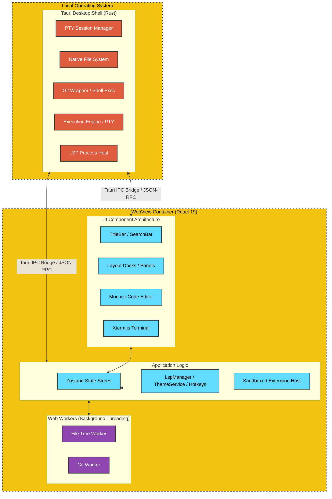

# Quantum IDE Overview

Welcome to the official developer and user documentation for **Quantum IDE**—a modern, lightweight, and extensible desktop code editor built for high-performance local development. 

Quantum combines the robustness of a Rust native backend with the flexibility and customizability of a React 19 web-based user interface. This page provides a high-level overview of the editor's design principles, its runtime architecture, and the complete technology stack that powers it.

---

## 1. Introducing Quantum

Quantum is engineered to be an IDE-grade desktop code editor that runs locally and integrates deeply with operating system capabilities. 

### Key Design Pillars
* **High Efficiency:** Low memory overhead and fast startup, utilizing Rust for system operations and PTY management.
* **Extensibility first:** A fully sandboxed JavaScript extension host allows third-party developers to register custom commands, add UI views, contribute status bar items, and interface directly with LSP servers.
* **Familiar & Adaptable Workbench:** A highly customizable VS Code-inspired layout featuring detachable panels, custom status/title bars, and flexible docking zones.
* **Deep Tooling Integration:** Out-of-the-box support for Language Server Protocol (LSP), a layered Execution Engine (run code, manage processes, pipe output), and multi-tier Git repository management.

---

## 2. High-Level Architecture

Quantum is structured as a hybrid desktop application utilizing **Tauri 2** as the shell container and **React 19** for the renderer workspace. The execution boundary is divided into two primary zones:

### The Rust Host (Backend)
The backend compiles to native machine code, running on the user's local operating system. It holds full system permissions and communicates with the frontend via Tauri's JSON-RPC-based IPC (Inter-Process Communication) bridge.
* **File System Operations:** Fast recursive directory reading, `.gitignore`-aware file tree builders, and CRUD commands.
* **Process Management:** Native PTY (Pseudo-Terminal) spawning, terminal session resizing, and shell shell-path detection.
* **Process Execution:** Launches user code (Execution Engine via PTY), git binaries, and language servers (LSP), handling standard inputs/outputs.

### The WebView Workspace (Frontend)
The frontend runs within a sandboxed WebView instance. It manages the user interface, renders the code editor (Monaco), displays terminal outputs (xterm.js), and houses the core state machines.
* **State Management:** Organized into 14 distinct **Zustand** stores, keeping components decoupled and ensuring rapid state propagation.
* **Web Workers:** Long-running calculations (such as parsing massive Git diffs, processing the file explorer tree, and formatting diagnostic lists) are delegated to dedicated Web Workers to ensure the main UI thread remains responsive (60fps).

---

## 3. Technology Stack Reference

The technologies powering Quantum are categorized below:

| Layer | Technology / Library | Purpose |
| :--- | :--- | :--- |
| **Desktop Shell** | Tauri v2 (Rust) | Native window wrapper, PTY spawning, dialogs, and OS permissions |
| **Frontend Framework** | React 19 + TypeScript | Interface rendering, component structures, and static typing |
| **Code Editor** | Monaco Editor | Text rendering, syntax highlighting, autocomplete, and editor UI |
| **Terminal Emulator** | Xterm.js v5 | ANSI escape sequence parsing and terminal output rendering |
| **State Management** | Zustand v5 | Fast, non-blocking global application state management |
| **Styling** | Tailwind CSS v4 | Clean, modular CSS utility utility system and design tokens |
| **Components** | shadcn/ui + Radix UI | Accessible design system primitives (popovers, tabs, buttons) |
| **Concurrency** | HTML5 Web Workers | Offloading CPU-heavy Git and File Tree queries from UI thread |
| **Testing** | Vitest + Testing Library | High-speed unit and component testing environment |

---

## 4. Documentation Navigation

To learn more about specific systems in Quantum, explore the following pages:

* **[Getting Started](file:///C:/Users/Bhavin/Videos/WEB dev/Code-editor/Documentation/GettingStarted.md):** System requirements, setup guides, and build scripts.
* **[User Interface](file:///C:/Users/Bhavin/Videos/WEB dev/Code-editor/Documentation/UserInterface.md):** Interface layouts, dock coordinates, presets, and detachable panels.
* **[Code Editor](file:///C:/Users/Bhavin/Videos/WEB dev/Code-editor/Documentation/CodeEditor.md):** Monaco features, multi-tabs, document outlines, and Markdown live previews.
* **[Terminal Integration](file:///C:/Users/Bhavin/Videos/WEB dev/Code-editor/Documentation/Terminal.md):** PTY setups, shell selection, and customization settings.
* **[Source Control](file:///C:/Users/Bhavin/Videos/WEB dev/Code-editor/Documentation/SourceControl.md):** Staging, committing, stashes, worktrees, bisecting, and GitHub OAuth integration.
* **[Execution Engine](file:///C:/Users/Bhavin/Videos/WEB dev/Code-editor/Documentation/Debugging.md):** Run files, manage processes, language detection, and output terminal.
* **[LSP Support](file:///C:/Users/Bhavin/Videos/WEB dev/Code-editor/Documentation/LSP.md):** Language server lifecycle, Monaco bridge, and Pyright integration.
* **[Extension Host](file:///C:/Users/Bhavin/Videos/WEB dev/Code-editor/Documentation/ExtensionSystem.md):** Custom command registries, manifest settings, and extension APIs.
* **[Settings & Themes](file:///C:/Users/Bhavin/Videos/WEB dev/Code-editor/Documentation/SettingsThemes.md):** System configurations, Custom CSS overrides, Theme Editor, and Hotkeys.
